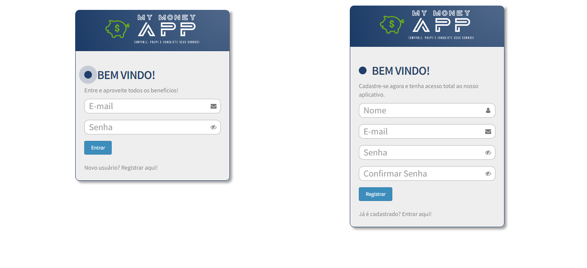
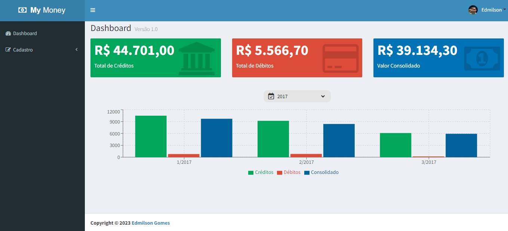
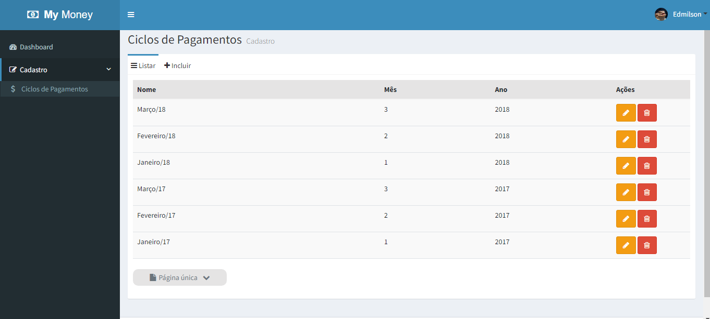

# My_money_app

## Projeto de Carteira Digital


### Login e Cadastro



### Dashboad



### Cadastro de Ciclos de Pagamentos



<br/>
<br/>
<ol>
    <li><a href="#sobre">Sobre</a></li>
    <li> <a href="#especificacoes">Especificações</a></li>
    <li> <a href="#comorodaroprojeto">Como Rodar o Projeto?</a> </li>
    <li> <a href="#resultados"> Resultados de Desenvolvimento</a> </li>
    <li> <a href="#desenvolvedor">Desenvolvedor</a></li>
</ol>

<h2 id="sobre">Sobre</h2>

O My Money App foi um projeto desenvolvido afins de estudo. Se trada de uma carteira digital, onde após cadastro e login, o usuário possa cadastrar receitas e despesas. A aplicação conta com dashboard com totais de créditos, debitos e consolidado e gráfico separado por ano, além de uma interface intuitiva para cadastro de novo ciclo, alteração ou remoção.

<h2 id="especificacoes">Especificações</h2>

<b>--></b> No backend utilizamos:

<ul>
<li>bcrypt: v.5.1.0</li>
<li>body-parser: v.1.18.3</li>
<li>express: v.4.16.3</li>
<li>mongoose: v.7.2.0</li>
<li>nodemon: v.1.18.4</li>
<li>express-query-int: v.3.0.0</li>
<li>jsonwebtoken: v.8.3.0</li>
<li>node-restful: v.0.2.6</li>
<li>MongoDB</li>
</ul>
<b>--></b> No frontend utilizamos:
<ul>
<li> axios: v.0.18.0</li>
<li> admin-lte: v.2.3.11</li>
<li> react: v.16.4.0</li>
<li> react-router-dom: v.4.3.1</li>
<li> font-awesome: v.4.7.0</li>
<li> redux: v.4.0.0</li>
<li> redux-form: v.7.4.2</li>
<li> react-redux: v.5.0.7</li>
<li> recharts: v.2.3.0</li>
</ul>

<b>--></b> Você pode verificar todas as dependências utilizadas no projeto no arquivo Package.json tanto na pasta de backend quanto na pasta de frontend.

<h2 id="comorodaroprojeto">Como rodar o projeto?</h2>

<b>Você precisará:</b>

<ul>
    <li>Node JS - versão 16.13.1 ou superior (obrigatório)</li>
    <li>Visual Studio Code (recomendado)</li>
    <li>Git bash </li>
    <li>Windowns 10 ou superior</li>
</ul>

```bash
#Clone este repositório no terminal:
$ git clone https://github.com/edmilsondmx/My_money_app.git
```

_OBS: Para que a aplicação funcione como esperado, você deve deixar o frontend e o backend rodando simultaneamente (abra dois terminais):_

```bash

#Com o primeiro terminal, abra a pasta backend e execute o comando:
$ npm install
ou
$ yarn install

#Em seguida inicie a aplicação através do comando abaixo:
$ npm run dev ou run production
ou
$ yarn run dev ou run production

#A aplicação (backend) será aberta na porta:3003

```

Agora que o backend está ativo, é necessário repetir o processo para o frontend:

```bash
#No segundo terminal, abra a pasta frontend e execute o comando:
$ npm install
ou
$ yarn install

#Em seguida inicie a aplicação através do comando abaixo:
$ npm start
ou
$ yarn start

#A aplicação(frontend) será aberta na porta:8080 - acesse http://localhost:8080.
```

Agora que tanto o backend quanto o frontend estão rodando, para acessar o sistema, você pode se cadastrar.
Na tela de login clique em <b>Novo Usuario? Registrar aqui!</b> -> cadastre-se (lembre de anotar seu e-mail e senha cadastrado, no momento não temos um sistema de recuperação de senha ativo). Coloque um e-mail válido e uma senha de 6 a 12 dígitos que contenha: número, caractere especial, letra minúscula e maiúscula.

<h2 id="resultados">Resultados de Desenvolvimento</h2>

- Implementação da interface com HTML, CSS, AdminLTE e React;
- Sistema de login (autenticação JWT com o banco de dados);
- Sistema de cadastro conectado ao banco de dados;
- Dashbord com resumos e gráficos dividido por ano;
- Registro de Ciclos de pagamentos, com campos de nome do ciclo, mês e ano;
- Registro de débitos e créditos, com nome e valor, e para débito o status;
- Possibilidade de alteração ou remoção de qualquer informação.
- Controle de estado da aplicação utilizando Redux;
- Mensagens visuais de confirmações ou erros de cadastro.

<h2 id="desenvolvedor">Desenvolvedor</h2>

|<br>_Desenvolvedor WEB_| Edmilson Gomes| [Linkedin](https://www.linkedin.com/in/edmilsondmx/)
